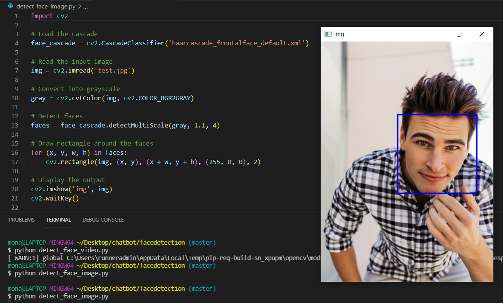

# Real time Face Detection using OpenCV & Python 

This project a is Real-Time Face recognition & image detection using OpenCV while performing object detection using Haar feature-based cascade classifiers for detecting face.


## install open cv library
First of all make sure you have OpenCV installed. You can install it using pip:

```
pip install opencv-python

```
 to gather all Haar classifiers files that you want to use  load its path  into your project or you can simply download it.
###### Note: you can find Haar cascade classifiers files here (https://github.com/opencv/opencv/tree/master/data/haarcascades)


## Setting up the camera 
To start we need to capture the face and to do so we are using the PC embedded camera which we are referring to it using (0) 

## Call the classifier function
We will set our camera and inside the loop, load our input video in grayscale mode then we must call our classifier function, passing it some very important parameters, as scale factor, number of neighbors and minimum size of the detected face.


## Detecting Faces
The function will detect  faces on the image. Next, we must "mark" the faces in the image, using, for example, a blue rectangle. 
If faces are found, it returns the positions of detected faces as a rectangle with the left up corner (x,y) and having "w" as its Width and "h" as its Height ==> (x,y,w,h). 


## Quit
If the user wants to quit the program, he or she can click on   ESC button.

## Result
You can see the result by using your camer or by using Image for test as showing here


